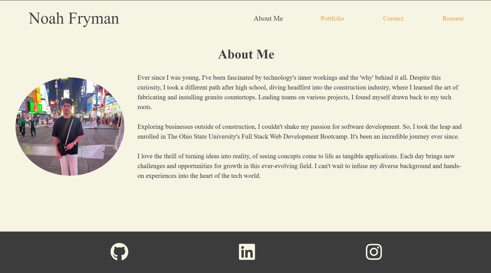

# react-portfolio

## Description

This is a revamp of my previous portfolio using react as my front end template. My portfolio includes: An About Me page that includes an image of myself and a description about me, a Portfolio page with my most recent projects with a link to the live application and to the Github repo, a Contact page where a viewer is able to contact me, and a Resume page that allows viewers to download my resume and view a list of my skills. 

## Functions

- Contact page checks for a valid email and checks for a required message.

- Resume page has a button that will on click download my resume as a pdf.

- Compatible on all screen sizes.

## Technologies Used

- Booststrap (CSS Framework)
- React (FrontEnd Template)
- React-router (Creating routes for pages)

## Usage

- You are able to view the live application with this [link]()